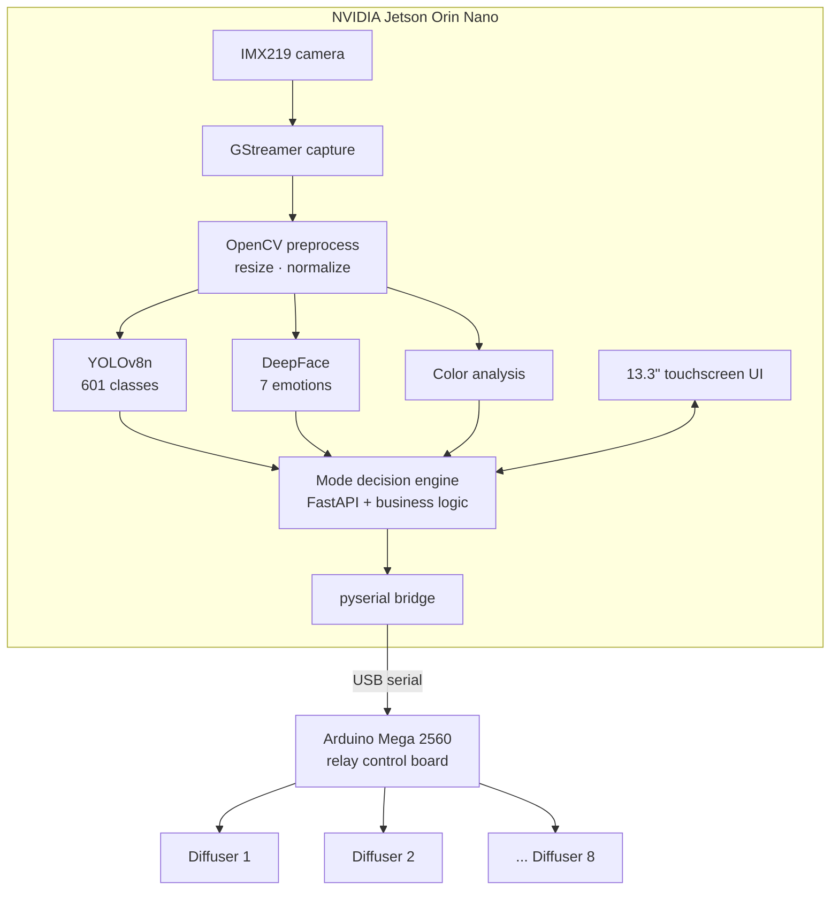

<div align="center">

# S.Y.N.A.P.S.E

### Smart Yielding Neuro-Adaptive Personalized Scent Experience

**AI-driven aromatherapy with edge inference and hardware control**


> **Status: 🚧 Source code in transfer from device — full push coming soon**

</div>

---

## What it does

S.Y.N.A.P.S.E is a real-time aromatherapy system that uses computer vision and edge AI to select and activate scent diffusers autonomously. A camera observes the environment or the person in front of the system; inference models classify what they see; the system chooses a scent profile and activates the matching diffuser hardware — all without a cloud dependency.

The entire AI inference stack runs locally on an NVIDIA Jetson Orin Nano. An Arduino Mega 2560 handles the hardware control layer, receiving commands over a serial bridge.

---

## Hardware

| Component | Role |
|-----------|------|
| NVIDIA Jetson Orin Nano | Primary compute — runs all AI inference |
| Arduino Mega 2560 | Hardware control — relay switching, sensor polling |
| 8× ultrasonic diffusers | Scent output layer, individually addressable |
| IMX219 camera | Vision input for CV and AI inference pipelines |
| 13.3" touchscreen | Local UI — mode selection, status, manual control |

---

## Software stack

| Layer | Technology |
|-------|-----------|
| Runtime | Python 3.10 |
| API server | FastAPI + Uvicorn |
| Object detection | YOLOv8n — 601-class model |
| Emotion recognition | DeepFace — 7 emotion classes |
| Vision pipeline | OpenCV + GStreamer (hardware-accelerated capture) |
| Serial comms | pyserial — Jetson ↔ Arduino bridge |
| Inference acceleration | CUDA on Jetson Orin Nano |

---

## Operating modes

| Mode | Trigger | Behavior |
|------|---------|----------|
| **Manual** | User touch input | Direct diffuser selection via touchscreen UI |
| **Scenario** | User touch input | Pre-defined scent profiles for named scenarios |
| **Color** | Camera → color analysis | Scent selected from dominant color of scene |
| **Emotion** | Camera → DeepFace | Scent chosen from detected facial emotion |
| **Object** | Camera → YOLOv8n | Scent associated with detected object class |

---

## Architecture



**Inference loop:**
1. GStreamer captures a frame from the IMX219 camera.
2. OpenCV preprocesses the frame (resize, normalize).
3. Active mode determines which model(s) run: YOLOv8n for object detection, DeepFace for emotion, or color analysis.
4. The decision engine maps the inference result to a scent profile.
5. A command is sent over pyserial to the Arduino, which toggles the appropriate relay.
6. The touchscreen UI updates to reflect the active scent and detected input.

---

## Setup (reference — full instructions with code)

**Prerequisites**
- NVIDIA Jetson Orin Nano with JetPack 5.x
- Arduino IDE for firmware upload
- Python 3.10 environment

```bash
# (instructions will be added when source is pushed)
git clone https://github.com/kirilov07/S.Y.N.A.P.S.E
cd S.Y.N.A.P.S.E
pip install -r requirements.txt
python main.py
```

---

## Future work

- [ ] PostgreSQL session logging (scent history, emotion trends)
- [ ] REST API for remote control and scheduling
- [ ] Mobile companion interface
- [ ] Expanded scent-to-object mapping (expanding beyond 601 YOLO classes)
- [ ] Multi-person detection with per-face independent inference

---

## License

MIT — see [LICENSE](LICENSE)

---

<div align="center">

Built by [Kiril Kirilov Kirilov](https://github.com/kirilov07) — Embedded Systems & AI Engineer

</div>
